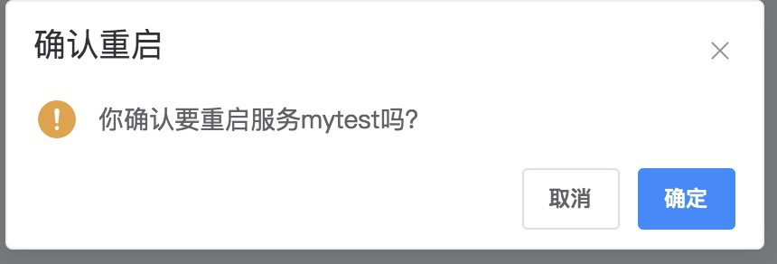
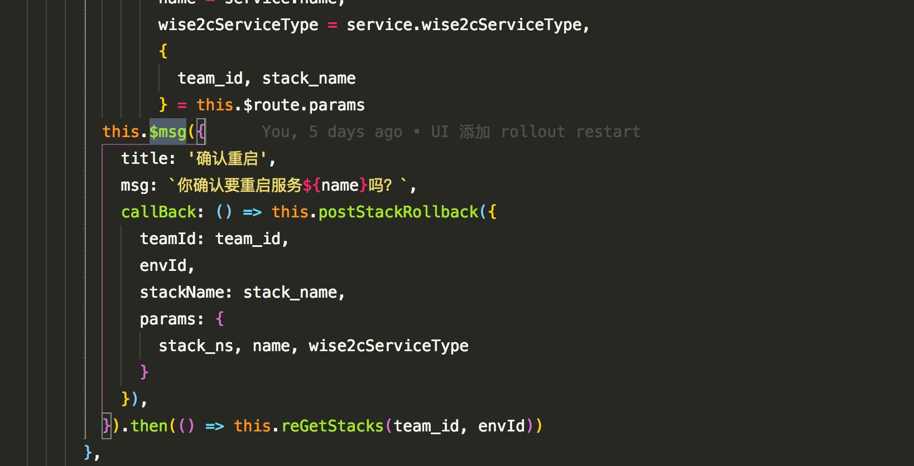

# element-ui 便捷弹窗


## 用法

``` javascript
this.$msg({
  title: '确认重启',
  msg: `你确认要重启服务${name}吗？`,
  callBack: () => this.postStackRollback({
    teamId: team_id,
    envId,
    stackName: stack_name,
    params: {
      stack_ns, name, wise2cServiceType
    }
  }),
}).then(() => this.reGetStacks(team_id, envId))

```
## 效果

## 代码

